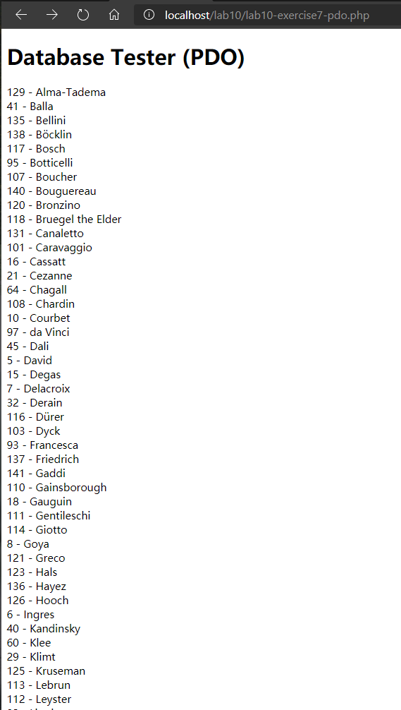
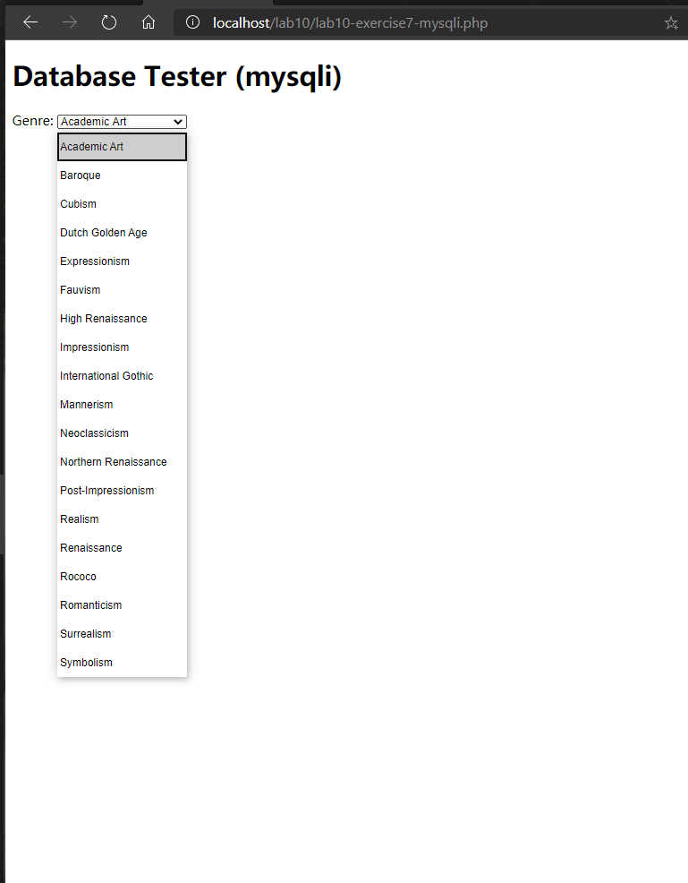
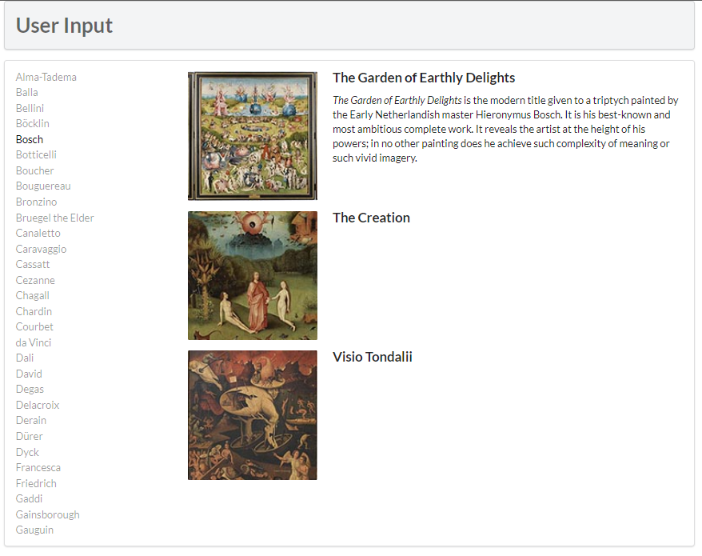
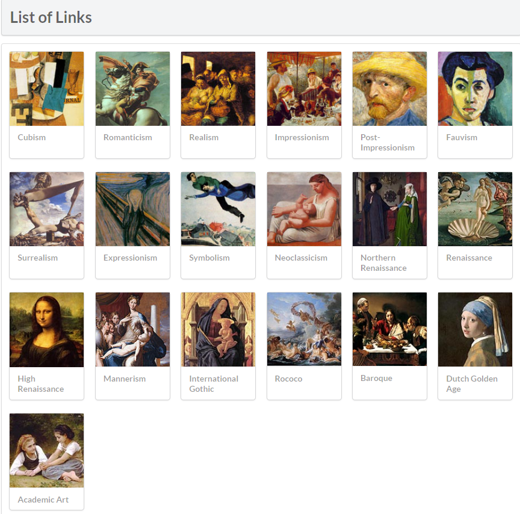
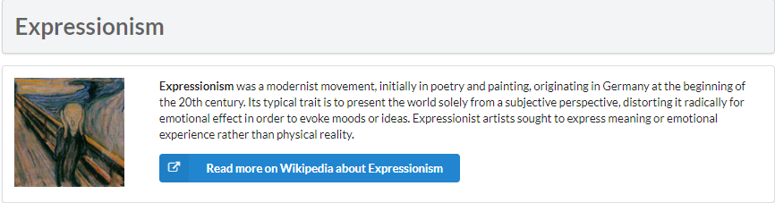

# Lab10

## Exercise7: MYSQL THROUGH PHP  

# 1. exercise7-pdo.php



   ```html
   <?php require_once('config.php'); ?>
   <!DOCTYPE html>
   <html>
   <body>
   <h1>Database Tester (PDO)</h1> <?php
   try {
     $pdo = new PDO(DBCONNSTRING,DBUSER,DBPASS);  
     $pdo->setAttribute(PDO::ATTR_ERRMODE, PDO::ERRMODE_EXCEPTION);  
     $sql = "select * from Artists order by LastName";
     $result = $pdo->query($sql);
     while ($row = $result->fetch()) {
         echo $row['ArtistID'] . " - " . $row['LastName'] . "<br/>"; 
     }
     $pdo = null; 
   }catch (PDOException $e) { 
       die( $e->getMessage() );
   }
   ?>  
   </body>  
   </html>
   ```

代码解释：<br/>
1、使用require_once语句加入预定义的用户名、密码、连接字符串的值 <br/>
2、在try语句块new一个PDO对象中创建连接，并设置异常处理模式 <br/>
3、使用pdo对象的query方法执行mysql语句，并将结果存储到result当中 <br/>
4、使用result的fetch方法遍历result中的各行，并将其格式化输出。读取到最后一行时fetch方法返回null，退出while循环 <br/>
5、将pdo设置为null来关闭连接<br/>


# 2. exercise7-mysqli.php



   ```html
   <?php require_once('config.php'); ?>
   <!DOCTYPE html>
   <html>
   <body>
   <h1>Database Tester (mysqli)</h1> Genre:
   <select>
   <?php  
   $connection = mysqli_connect(DBHOST, DBUSER, DBPASS, DBNAME); 
   if ( mysqli_connect_errno() ) {
      die( mysqli_connect_error() ); 
   }
   $sql = "select * from Genres order by GenreName"; 
   if ($result = mysqli_query($connection, $sql)) {
     // loop through the data
     while($row = mysqli_fetch_assoc($result)) {
        echo '<option value="' . $row['GenreID'] . '">'; 
        echo $row['GenreName'];
        echo "</option>";
     }
     // release the memory used by the result set
     mysqli_free_result($result); 
   }
   // close the database connection
   mysqli_close($connection);
   ?>
   </select>
   </body>
   </html>
   ```

代码解释：<br/>
1、使用require_once语句加入预定义的用户名、密码、连接字符串的值 <br/>
2、在try语句块中使用mysqli方法创建连接 <br/>
3、使用pdo对象的mysqli_query方法执行mysql语句，并将结果存储到result当中 <br/>
4、使用result的mysqli_fetch_assoc方法遍历result中的各行获取关联数组，并将其格式化输出到下拉列表的选项中。读取到最后一行时返回null，退出while循环 <br/>
5、使用mysqli_free_result和mysqli_close释放内存并关闭连接<br/>


# 3. exercise8



   ```html
   <main class="ui container">
      <div class="ui secondary segment">
         <h1>User Input</h1> 
      </div>
      <div class="ui segment">
         <div class="ui grid">
            <div class="four wide column">
               <div class="ui link list"> 
                  <?php outputArtists(); ?>
               </div>
            </div>
            <div class="twelve wide column"> 
               <div class="ui items">
                  <?php outputPaintings(); ?>
               </div>
            </div>
         </div>
      </div>
   </main>
   ```  
代码解释：<br/>
1、引入outputArtists和outputPaintings来输出作者列表和相应的画作<br/>
2、outputArtist中：<br/>
   创建连接，获取Artist数据表中的数据并按照LastName进行排序<br/>
   对每一行数据，输出一个链接元素到html文档中，地址指向对应的脚本文件<br/>
   将选中的作家的链接元素的class设置为active<br/>
3、outputPaintings中：<br/>
   创建连接，获取Paintings数据表中ArtistId为选中作家id的数据<br/>
   调用outputSinglePaintings输出每一张图片<br/>
4、outputSinglePaintings中：找到对应图片的地址，按照格式输出画作的内容、名字、描述等信息<br/>

# 4. exercise9

   ```php
   function outputPaintings() {
      try {
         if(isset($_GET['id']) && $_GET['id'] > 0) {
           $pdo = new PDO(DBCONNSTRING,DBUSER,DBPASS); 
           $pdo->setAttribute(PDO::ATTR_ERRMODE, PDO::ERRMODE_EXCEPTION);
   
           $sql = 'select * from Paintings where ArtistId=:id'; 
           $id = $_GET['id'];
   
           $statement = $pdo->prepare($sql); 
           $statement->bindValue(':id', $id); 
           $statement->execute();
   
           while ($row = $statement->fetch()) { 
              outputSinglePainting($row);
           }
           $pdo = null;
         }
      }catch(PDOException $e) { 
         die( $e->getMessage() );
      }
   }
   ```  

代码解释：<br/>
1、创建连接，设定sql语句。将sql语句传入pdo的prepare方法，将返回值存储在statement中<br/>
2、将ArtistId的值与url中的id参数的值绑定，并替换sql语句中的:id<br/>
3、使用statement的execute方法，返回结果存储在statement中<br/>
4、使用fetch方法遍历各行<br/>

预处理语句的好处：<br/>
1、预处理语句用于执行多个相同的 SQL 语句，并且执行效率更高<br/>
2、预处理语句可以防止MySQL注入<br/>


# 5. exercise10





   ```php
   function outputGenres() { 
      try {
         $pdo = new PDO(DBCONNSTRING,DBUSER,DBPASS); 
         $pdo->setAttribute(PDO::ATTR_ERRMODE, PDO::ERRMODE_EXCEPTION);
   
         $sql = 'select GenreId, GenreName, Description from Genres Order By GenreID';
         $result = $pdo->query($sql); 
         
         while ($row = $result->fetch()) {
            outputSingleGenre($row); 
         }
         $pdo = null;
      }catch (PDOException $e) {
         die( $e->getMessage() ); 
      }
   } 
   ```

   ```php
   function outputSingleGenre($row) {
      echo '<div class="ui fluid card">';
      echo '<div class="ui fluid image">';
      $img = ''; 
      echo constructGenreLink($row['GenreId'], $img);
      echo '</div>';
      echo '<div class="extra">';
      echo '<h4>';
      echo constructGenreLink($row['GenreId'], $row['GenreName']);
      echo '</h4>';
      echo '</div>'; // end class=extra
      echo '</div>'; // end class=card
      }
   ```  

   ```php
   function constructGenreLink($id, $label) {
      $link = '<a href="genre.php?id=' . $id . '">'; 
      $link .= $label;
      $link .= '</a>';
      return $link;
   }
   ```    
代码解释：<br/>
1、创建连接并获取数据表Genres中GenreId、GenreName、Description的信息，并且按照GenreId进行排序<br/>
2、对结果的各行调用outputSingleGenre语句<br/>
3、在outputSingleGenre中按照格式创建每个Genre的内容，并且调用constructGenreLink函数创建链接元素<br/>