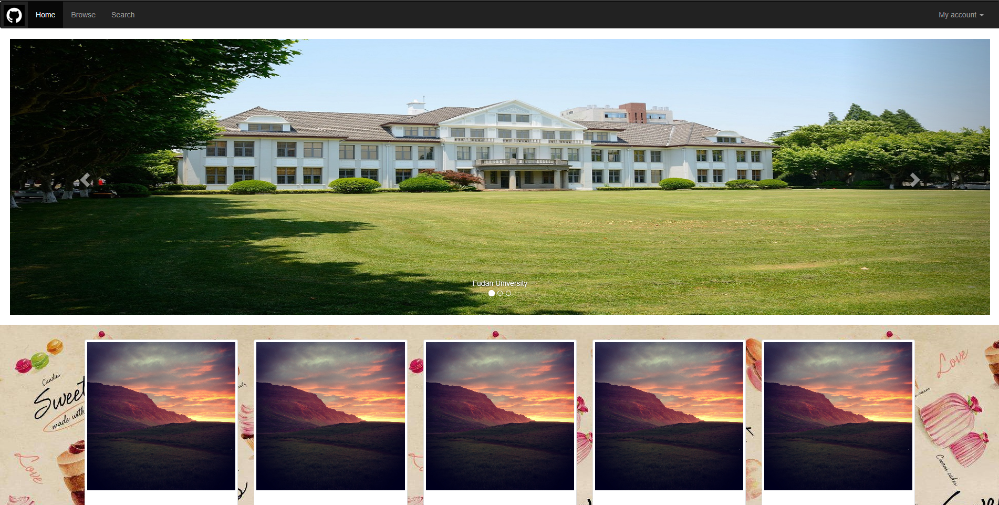
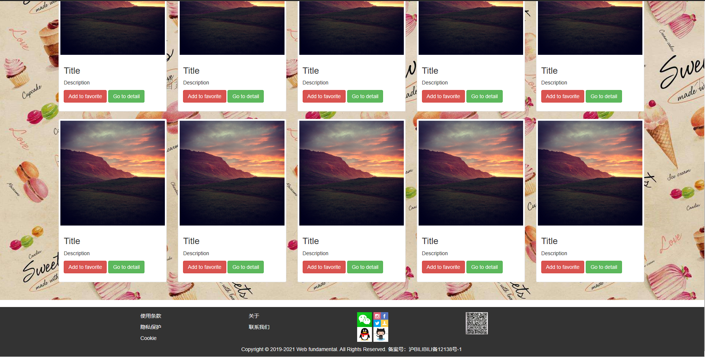

-------------------

## 说明
```
1.为缺少缩略图、头图的地方填充图片，提供image文件夹下的url
2.缩略图展示部分使用了bootstrap的网格系统代替了原本的表格，使用col-md-*进行布局，一行五块，将12分为1，2，2，2，2，2，1，中间五个2的部分用于放图
3.缩略图使用了bootstrap提供的thumbnail类，很方便，在其中内置了图片、链接、按钮
4、按钮可使用btn-*直接改变颜色，这里使用了btn-danger和btn-success
5、缩略图部分使用了背景
6、其他位置上的微调还是用原生css来实现
```

-----------------

## 主页截图

如下：


