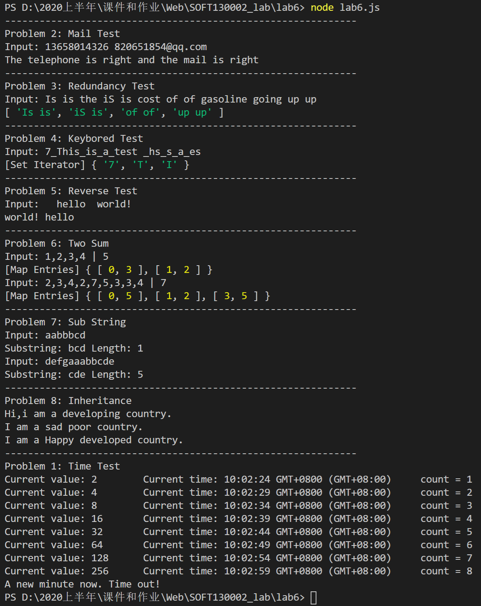
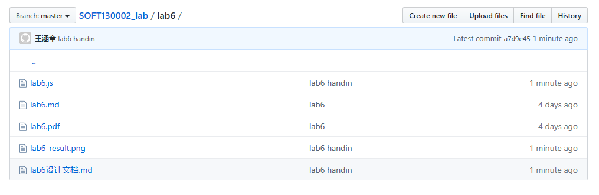

# Lab6设计文档

18307130214 王涵章

## 各个正则表达式的解释：

### 电话号码：/^1[3456789][0-9]{9}$/;

1开头，3456789作第二个数字，剩下的9位可由数字自由组成

### 电子邮箱：/^[a-zA-Z0-9_-]+@[a-zA-Z0-9_-]+(\.[a-zA-Z0-9_-]+)+$/;

@之前的部分是登录名，一般认为由数字、字母、下划线、-组成，@之后为主机名，由若干个域名之间由.连接组成
 
### 连续两个相同单词：/\b([a-z]+) \1\b/ig;

两个\b表示匹配发生在两个单词的前后空格之间，([a-z+])匹配第一个单词并存入缓冲区，用\1表示
 
### 一个以上的空格：/ +/

用作split的参数

## 继承不同方式的理解

### 构造函数

本质是在子类的构造函数中使用apply方法调用父类的构造函数，把父类的属性加入到子类中

### 原型链

本质是将子类的原型作为父类的实例，这样在访问子类的某些属性或方法时若子类本身没有定义，则会去访问它的原型（即父类）

### Object.create

本质是创建一个父类的实例并使用Object.create的方法将它的属性进行扩展

## Map、Set、Array之间的区别和使用

Map类似于对象，它由若干键值对组成，但是键名可以是任意类型而不像对象的键名是标识符
Set类似于数组，它的元素不重复，如果add方法尝试加入已有的元素则什么也不会发生，可用于统计哪些量（如字符串中的字符）出现过
Array是特殊的对象，它的键名是数，可以用下标的方式进行索引

## 截图

### 程序运行结果

### github提交截图

