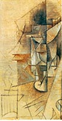

# Lab07设计文档

王涵章 18307130214

## 总体思路

将lab7文件夹拷贝一份，尝试填写html文件达到图中的效果
最后发现将每个work对象转换成如图的html元素可以达到要求

    

        <h4>Element h4</h4>
        

            <h3 style="display:inline-block;margin-right:0.5em;">
                h3 element 
            </h3>
            lifetime
        

        

            <h3>
                h3 element
            </h3>
            
            
            
        

        <button>Visit</button>
    

## 遇到的困难

作者名称后面的lifetime样式不同：说明作者名称要受样式单中h3的声明影响，而lifetime要受item的声明影响，则lifetime不在h3内部

## 解决方案

将h3设置style特性为行内元素，向右设定间距达到效果
